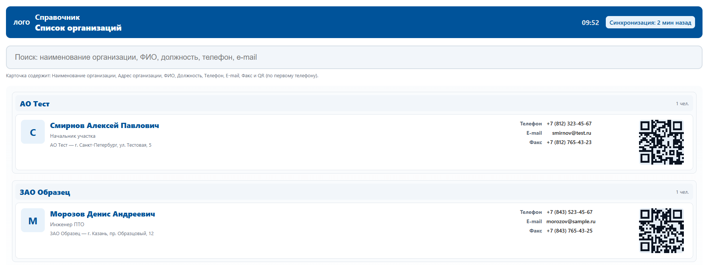

# 📇 Контакты с QR-кодами



Веб-приложение для удобного отображения списка контактов с возможностью быстрого доступа по QR-кодам.  
Каждый контакт содержит ФИО, должность, организацию, телефоны, email, факс и адрес.  
Поиск работает быстро даже на больших списках благодаря оптимизации.

## 🚀 Возможности

- Отображение списка сотрудников по организациям  
- Генерация QR-кода для номера телефона 
- Увеличенный QR-код по клику на карточку
- Поиск по всем полям (ФИО, должность, организация, телефоны, email, адрес)
- Современный светлый дизайн с основным цветом **#00539A**
- Адаптивная вёрстка для мобильных устройств

## ⚙️ Используемые технологии

- **HTML5**  
- **CSS3 (Flexbox, адаптивность)**  
- **Vanilla JavaScript**  
- [QRCode.js](https://cdnjs.com/libraries/qrcodejs) — генерация QR-кодов  

## 🖥️ Как запустить

1. Склонировать проект или скачать архив  
2. Убедиться, что структура папок сохранена  
3. Открыть `index.html` в браузере  

## 📱 Использование

- Введите запрос в строке поиска, чтобы фильтровать контакты  
- Нажмите на карточку контакта — откроется увеличенный QR-код телефона  
- Нажмите `×` или на фон, чтобы закрыть модальное окно  

## 🔧 Настройка

Файл `script.js` содержит массив `people` в формате:

```json
  {
    "id": "1",
    "org": "Компания",
    "name": "Иван Иванов",
    "pos": "Должность",
    "phones": ["+7 (999) 123-45-67"],
    "email": "test@example.com",
    "fax": "123-456",
    "address": "г. Москва, ул. Примерная, д. 1"
  }
```

